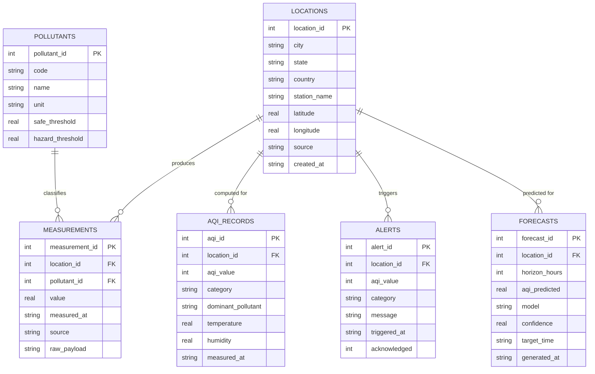

# ER Diagram & Schema Documentation

## Logical Model

```
+----------------+        +----------------------+         +-----------------+
|   locations    |        |     measurements     |         |   pollutants    |
+----------------+        +----------------------+         +-----------------+
| PK location_id |<------>| FK location_id       |<------->| PK pollutant_id |
| city           |   1..* | FK pollutant_id      |   *..1  | code            |
| state          |        | value                |         | name            |
| country        |        | measured_at          |         | unit            |
| station_name   |        | source               |         | safe_threshold  |
| latitude       |        | raw_payload (JSON)   |         | hazard_threshold|
| longitude      |        | created_at           |         +-----------------+
| source         |        +----------------------+
| created_at     |
+----------------+
       |
       | 1
       |
       | *
+----------------+        +-----------------+        +--------------------+
|  aqi_records   |        |     alerts      |        |     forecasts      |
+----------------+        +-----------------+        +--------------------+
| PK aqi_id      |        | PK alert_id     |        | PK forecast_id     |
| FK location_id |        | FK location_id  |        | FK location_id     |
| aqi_value      |        | aqi_value       |        | horizon_hours      |
| category       |        | category        |        | aqi_predicted      |
| dominant_pol.. |        | message         |        | model              |
| temperature    |        | triggered_at    |        | confidence         |
| humidity       |        | acknowledged    |        | target_time        |
| measured_at    |        +-----------------+        | generated_at       |
| created_at     |                                   +--------------------+
+----------------+

+----------------+
|   etl_runs     |   (audit log, no FK)
+----------------+
| PK run_id      |
| started_at     |
| finished_at    |
| source         |
| records_in     |
| records_out    |
| status         |
| error_message  |
+----------------+
```

## Mermaid Source



## Cardinality Notes
- **locations : measurements** = 1 : N (one station yields many readings).
- **pollutants : measurements** = 1 : N (one pollutant has many readings).
- **locations : aqi_records** = 1 : N (one snapshot per `(location, timestamp)`; enforced by `UNIQUE`).

## Normalization
The schema is in **3NF**:
- Each non-key column depends on the table's primary key only (no partial / transitive dependencies).
- `pollutants` is extracted as its own table because pollutant attributes (`name`, `unit`, `safe_threshold`) depend only on `pollutant_id`, not on the measurement.
- Computed `aqi_records` and `alerts` are stored separately rather than as derived attributes on `measurements` because they aggregate across multiple pollutants.

## Indexing Strategy
| Index | Purpose |
|-------|---------|
| `idx_measurements_loc_time`  | Location-scoped time-range queries (trends) |
| `idx_measurements_pollutant_time` | Pollutant breakdown queries |
| `idx_aqi_loc_time` | Latest-AQI-per-location lookups |
| `idx_alerts_triggered` | Recent alerts feed |
| `idx_forecasts_loc_target` | Forecast lookup for a target time |
